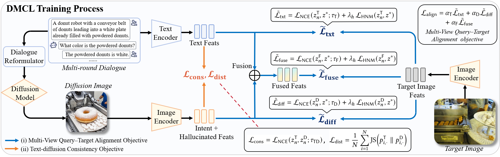

<h1 align="center">
🧠Towards Hallucination-Robust Diffusion Augmented Interactive
Text-to-Image Retrieval</h1>

<p align = "center">

</p>


* **Official PyTorch implementation for paper:  "Towards Hallucination-Robust Diffusion Augmented Interactive Text-to-Image Retrieval "** <br>

## 📰 Updates
- [2026/01/27] The code of DMCL is released! 🎉

## 🗞️ Table of Contents
- [Setup](#-setup)
- [Download Pretrained Weights](#-download-the-beit-3-pretrain-weight-for-retrieval-task)
- [Data Preparation](#-data-preparation)
- [Download Checkpoints](#-download-our-checkpoints)
- [Training and Evaluation](#-training-and-evaluation)
- [Acknowledgements](#-acknowledgements)
- [License](#-license)
- [Citation](#-citation)

## 🛠️ Setup
First, clone this repository to your local machine, and install the dependencies.
```bash
pip install -r requirements.txt
```
❗ You can modify the PyTorch version to suit your machine.

## ⬇️ Download The BEiT-3 Pretrain Weight for Retrieval Task
This project relies on the official Microsoft BEiT-3 implementation and pretrained weights.
Download the pretrain model weights and the tokenizer model for retrieval task.
   - [`BEiT3-base-itc`](https://github.com/microsoft/unilm/tree/master/beit3#pretrained-models): #layer=12; hidden=768; FFN factor=4x; #head=12; patch=16x16; #parameters: 222M
   - [`beit3.spm`](https://github.com/microsoft/unilm/tree/master/beit3#pretrained-models): the sentencepiece model used for tokenizing texts.

## 💾 Data Preparation
Please download the required datasets from the following sources:
   - [`VisDial v1.0`](https://visualdialog.org/): The foundational dataset used for constructing our training data training and evaluation, consisting of images and multi-turn dialogues.
   - [`DAI-TIR Dataset`](https://drive.google.com/drive/folders/1JhXEoeiuwKNsVlm6LdJXFcbxYMcaJTw6?usp=sharing): This dataset contains the diffusion-augmented training samples described in our paper.The dataset is currently being prepared for release. We will update this section with the download link upon acceptance.
   - [`ChatIR Benchmark`](https://github.com/levymsn/ChatIR?tab=readme-ov-file#table-of-contents): Four eval benchmark diglogue dataset with diverse dialogue styles (e.g., ChatGPT, Human).
   - [`PlugIR`](https://github.com/Saehyung-Lee/PlugIR): A dataset featuring concise, summary-style queries generated via an interactive pipeline.

## 🗂️ Download our checkpoints
The checkpoints will be made publicly available upon acceptance of the paper.

## 🚀 Training and Evaluation

###  Directory Structure

To ensure the code runs correctly, you can organize your project directory as follows. Alternatively, you can modify the paths in `dmcl_config.py` to match your custom directory structure.

```text
.
├── beit3/                      # Official Microsoft BEiT-3 code
│   ├── modeling_finetune.py    # Core modeling code
│   ├── optim_factory.py        # Optimizer utilities
│   └── ...
├── data/                       # Dataset root directory
│   ├── visdial_1.0_train.json  # VisDial v1.0 training file
│   ├── query_images/           # Training reference images (DA-VisDial)
│   │   ├── train-xxxx_0.jpg
│   │   └── ...
│   ├── ChatIR_Protocol/        # Validation Corpus
│   │   └── Search_Space_val_50k.json
│   ├── dialogues/              # Validation Queries
│   │   └── VisDial_v1_0_queries_val.json
│   └── generated_images/       # Pre-generated images for validation
│       └── VisDial_v1_0_queries_val/
│           └── your_generated_images/
├── model/                      # Pretrained Checkpoints
│   ├── beit3_base_itc_patch16_224.pth
│   └── beit3.spm
├── dmcl_config.py
├── train.py
├── eval_dmcl.py
├──README.md
└── ...
```

### Training
You can adjust the training hyperparameters by passing command-line arguments. Alternatively, you can configure them directly by modifying dmcl_config.py, allowing you to simply run:
```bash
python train.py
```

### Evaluation
To perform a complete evaluation of the experiment, run the following command:
```bash
python eval_dmcl.py
```

## 🤝 Acknowledgements

Our code is built upon the excellent work of [Microsoft BEiT-3](https://github.com/microsoft/unilm/tree/master/beit3). We thank the authors for their open-source contribution.

We also express our gratitude to the following projects for providing datasets and evaluation protocols:
* [VisDial v1.0](https://visualdialog.org/) for the visual dialogue dataset.
* [ChatIR](https://github.com/levymsn/ChatIR) and [PlugIR](https://github.com/Saehyung-Lee/PlugIR) for the interactive text-to-image benchmarks and baselines.

## ⚖️ License

This project is licensed under the **MIT License**. See the [LICENSE](LICENSE) file for details.

## ✏️ Citation

If you find this code useful for your research, please consider citing our paper:


